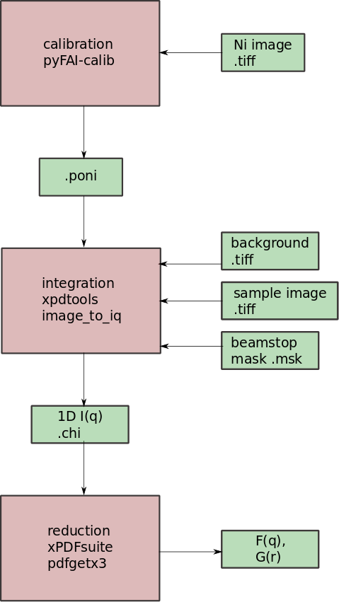

# Reduction of 2D synchrotron powder diffraction data to the PDF

##  Introduction and Overview

This tutorial is aimed at getting you started in the process of taking raw data from 
a rapid acquisition PDF (RAPDF) setup at a synchrotron and taking it all the way to 
the form of a PDF.  This describes the current (2018) workflow in the Billinge group
at Columbia University.  The process makes use of home-written software tools (xpdtools,
PDFgetX3/xPDFsuite) and other awesome tools (PyFai).  

This tutorial describes the steps to do the data reduction, and some tips and tricks. 
It does not describe the theory behind the different steps, which can be found in other
sources such as the Egami and Billinge book, and related articles.

### Prerequisites
**Make sure you have the following installed:**

Install xPDFsuite or PDFgetX3\
[xPDFsuite](http://www.diffpy.org/products/xPDFsuite.html)\
[pdfgetX3](https://www.diffpy.org/products/pdfgetx3.html)

This will all be done in a **python 3** environment. We recommend creating a 
conda environment.  If you have Anaconda installed this can be done by opening
a terminal/command propmt window and typing

`conda create -n data_reduction python=3`

then, on windows:\\
`activate data_reduction`\\
or on linux:\\
`source activate data_reduction`\\
then\\
`conda install xpdtools -c conda-forge`  [installation instructions](https://github.com/xpdAcq/xpdtools)\
`pip install pyfai`


**Make sure you have the following accessible:**

* To do calibration, you will need the special expanded D-spacings file (in repo) <!-- * beamstop-only mask (unfortunately this currently must be built in fit2d. For now there's one in the repo that corresponds to the example data))
-->
* Ni calibration image(s)
* Background image(s)
* Sample image(s)

These are all available in the xpdtools-practical folder

**Overview:**



## Step 1: Calibration

**Frequency:** once per geometry per beamtime

**Input**: 

* Ni D-spacings file: Ni03_expanded.D
* Experimental parameters: 
  * wavelength*
  * type of detector
* Ni 2D image in same geometry as the samples in the form of a .tiff image

**Function**: 

* Environment required: python 3
* pyFAI-calib 
* Procedure:
  * Call the function with the following: `pyFAI-calib -w [wavelength in A] -D Perkin -c /path/to/Ni03_expanded.D -P .99 image.tif`
    * Perkin is the detector at XPD and PDF; check the pyFAI-calib docs if you need other options
  * Select rings 0, 1, 2, and 5
  * when done, type `recalib`
  * when recalib finishes, type `done`

**Output**: 

* calibration in the form of a .poni file

***IMPORTANT:** Make sure the wavelength used in creating your .poni file is optimized before integrating sample images. Only one person needs to do this per beamtime; you can usually ask Soham or Liz to see if they've done it. If no one has already refined the wavelength, see the section at the end on doing so.

**To sanity check your calibration:** Carry out the following procedure (no background necessary) for the Ni image. Perform a refinement and check that on the Nyquist grid from 1.5 to 60 the rw value is roughly 0.03 with no structure in the residual.

## Step 2: Background Selection

**Frequency: ** Once per set of samples (with same geometry and experimental parameters)

Consider the most appropriate background for your sample. If possible it should have the

* same filter settings 
* same inverse frame rate (`frame_acq_time` in metadata) 

as the image you want to integrate.

**If you want to subtract background at the PDF level instead of the image level, skip this step. I usually try both for a representative sample to see what provides better data quality. I tend to favor PDF level background subtraction for very low scattering samples.** 

## Step 3: Integration

**Frequency:** Once per shot

**Input:**

* image file (.tiff)
* beamstop mask* (.msk)
* calibration file (.poni)
* (optional) background image (.tiff)

**Function:**

```
image_to_iq --poni-file PONI_FILE --image-files IMAGE_FILES --mask-file BEAMSTOP_MASK_FILE [--bg-file BG_FILE  --polarization POLARIZATION --edge EDGE --lower-thresh LOWER_THRESH --upper-thresh UPPER_THRESH --alpha ALPHA --auto-type AUTO_TYPE --mask-settings MASK_SETTINGS --flip-input-mask FLIP_INPUT_MASK]
```

See `image_to_iq -- --help` for more options 

**Output:**

* .chi file: I(q)

**Note: if you are integrating a background image to do PDF-level background subtraction in the future, use the output mask from your image integration as the input mask for the background image integration to reduce noise.**

## Step 4: Transform to PDF

**Frequency:** Once per shot

**Input:** I(q) data (.chi)

**Function:** xPDFsuite or pdfgetX3

**Output:** F(q) and G(r) data, (.gr and .fq)

**Things to consider in making this transformation:**

* If performing background subtraction at this step: the background scale (no kapton signal in PDF)
* Qmax: high enough that we get the spatial resolution we need, but low enough that we don't include too much noise
* Qmin: don't want to eliminate real data, but don't want false "signal" from baseline oscillations
* Qmaxinst: want F(q) to be zero at high q
* rpoly*: usually don't want to mess with this unless you have to, but in cases where you need a correction to your background subtraction it can be useful

## A1: Wavelength Refinement

**Procedure:**

For discrete wavelength values, stepping by 0.05 A from what the beamline scientists provided, do the following:

* Produce a .poni calibration according to step 1

* Integrate the Ni image according to step 3 (no need to use a background image)

* Transform to PDF according to step 4 and with the following parameters:

  | Parameter | Value      |
  | --------- | ---------- |
  | Qmax_inst | 26.0 AA^-1 |
  | Qmax      | 25.0 AA^-1 |
  | Qmin      | 0.4 AA^-1  |
  | rpoly     | 0.9        |

* Refine Ni model to the PDF data
  * scale, lattice parameter, ADPs, delta2 on data grid over 1.5-30 Angstroms
  * free qdamp and qbroad and refine on Nyquist grid over 1.5-60 Angstroms
* Optimize wavelength for $r_w$, should end up being between 0.02-0.03 for best wavelength
